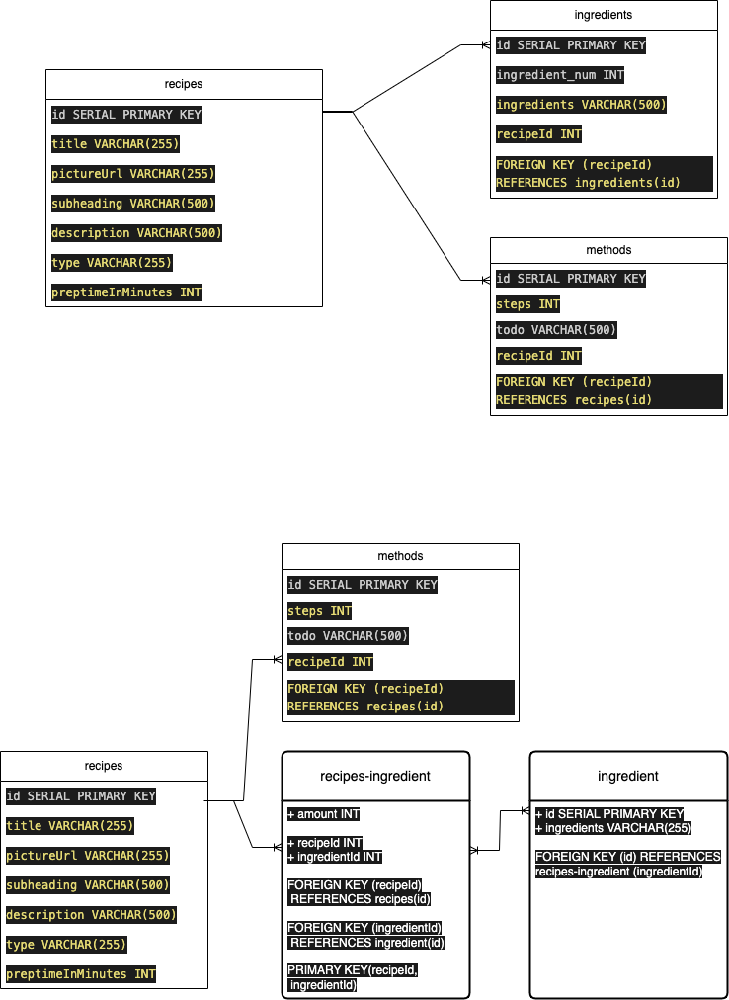

# contentful-to-postgre
This repo contains some codes that
1. fetch data from contentful
2. create a table in postgreSQL (ElephantSQL)
3. insert data into it

!! Since the image data is still stored in the contentful, we cannot delete the contentful!

